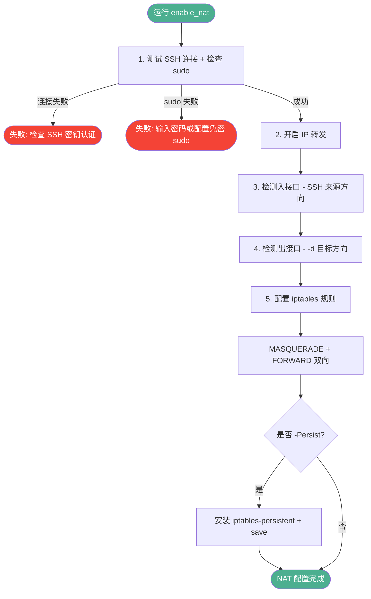
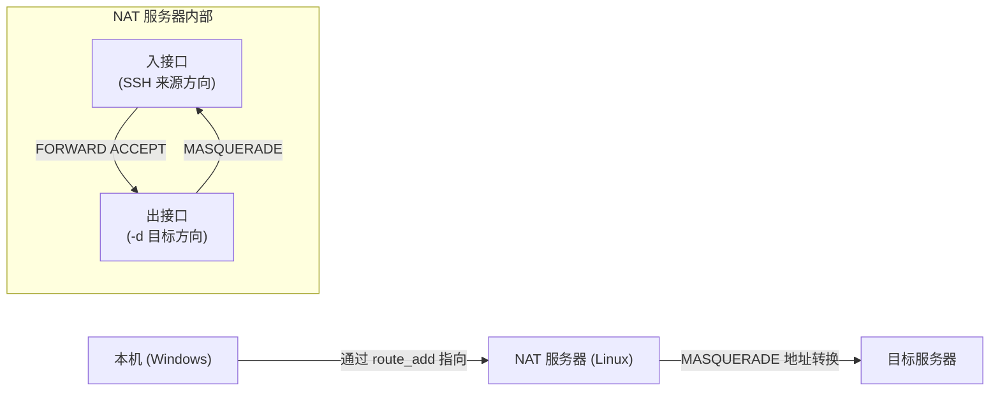
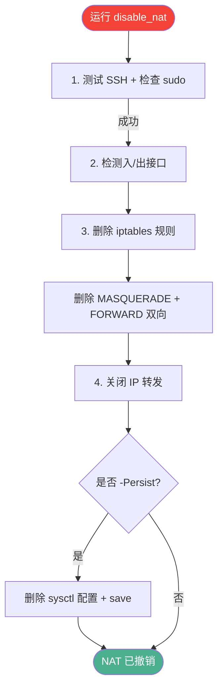

# IP Tools

Windows 网络配置管理 PowerShell 脚本，支持 IPv4 和 IPv6 双协议栈。

## 功能特性

- 显示所有网络适配器状态（IPv4/IPv6）
- 显示路由表和默认网关（IPv4/IPv6）
- 网络连通性测试与路由追踪
- 静态路由管理（添加/删除，自动检测接口）
- 三种 IP 配置模式：静态 IP、DHCP+自定义 DNS、静态 IP+网关
- IP 冲突自动处理
- 设置默认路由优先级（set_first）
- ICS 网络共享配置（set_ics）
- 远程 NAT 网关配置（enable_nat / disable_nat，通过 SSH 自动配置 Linux 服务器）

## 系统要求

- Windows 10/11 或 Windows Server 2016+
- PowerShell 5.1+
- 管理员权限（修改 IP 配置时需要）
- OpenSSH 客户端（使用 `enable_nat` / `disable_nat` 时需要，Windows 10+ 内置）

---

## 快速使用

所有命令一览，每个命令附带最常用示例。

### 查看网络状态

```powershell
.\ip.ps1                              # 显示所有适配器 + 路由表
```

### 测试连通性

```powershell
.\ip.ps1 ping                         # 测试默认目标 (8.8.8.8)
.\ip.ps1 ping baidu.com               # 测试指定域名
.\ip.ps1 ping 192.168.1.1             # 测试指定 IP
```

### 路由追踪

```powershell
.\ip.ps1 trace_route 172.17.1.126
```

### 静态路由管理

```powershell
.\ip.ps1 route_add 172.17.1.126                        # 添加到默认网关，自动检测接口
.\ip.ps1 route_add 172.17.1.126 192.168.1.1            # 指定网关，自动检测接口
.\ip.ps1 route_add 172.17.1.126 192.168.1.1 -dev eth0 # 指定网关和接口
.\ip.ps1 route_del 172.17.1.126                        # 删除路由（支持 IP 或 CIDR）
```

### 设置主网络适配器

```powershell
.\ip.ps1 set_first "wifi网络"          # 将适配器设为最高优先级默认路由
```

### 配置 IP 模式

```powershell
.\ip.ps1 set_profile 1 "以太网"        # 静态 IP 192.168.137.1/24
.\ip.ps1 set_profile 2 "以太网"        # DHCP + 自定义 DNS
.\ip.ps1 set_profile 3 "以太网"        # 静态 IP 192.168.50.11/24 + 网关
```

### ICS 网络共享

```powershell
.\ip.ps1 set_ics "wifi网络" "eth0"     # 将 wifi 网络共享给 eth0
```

### 远程 NAT 网关

```powershell
# 开启 NAT（通过 SSH 配置 Linux 服务器）
.\ip.ps1 enable_nat 192.168.137.2 -d 172.17.1.122 -Persist

# 撤销 NAT
.\ip.ps1 disable_nat 192.168.137.2 -d 172.17.1.122 -Persist
```

## 命令速查

| 命令 | 功能 | 权限 |
|------|------|------|
| `.\ip.ps1` | 显示所有网络信息 | 普通 |
| `.\ip.ps1 ping [目标]` | 测试网络连通性 | 普通 |
| `.\ip.ps1 trace_route <目标>` | 路由追踪 | 普通 |
| `.\ip.ps1 route_add <目标> [网关] [-dev <接口>]` | 添加静态路由（自动检测接口） | 管理员 |
| `.\ip.ps1 route_del <目标>` | 删除路由 | 管理员 |
| `.\ip.ps1 set_first <适配器>` | 设置主网络适配器 | 管理员 |
| `.\ip.ps1 set_profile <1\|2\|3> [适配器]` | 应用 IP 配置 | 管理员 |
| `.\ip.ps1 set_ics <源适配器> <目标适配器>` | 配置 ICS 网络共享 | 管理员 |
| `.\ip.ps1 enable_nat <服务器> [-d <目标>] [-Persist]` | 配置远程 Linux NAT 网关 | SSH |
| `.\ip.ps1 disable_nat <服务器> [-d <目标>] [-Persist]` | 撤销远程 Linux NAT 配置 | SSH |

---

## 详细说明

### 静态路由管理 (route_add / route_del)

#### route_add

**用法**

```powershell
.\ip.ps1 route_add <destination> [gateway] [-dev <interface>]
```

**参数**

| 参数 | 必需 | 说明 |
|------|------|------|
| `<destination>` | 是 | 目标 IP 或网络（如 `172.17.1.126`） |
| `[gateway]` | 否 | 网关 IP，不指定则使用默认网关 |
| `-dev <interface>` | 否 | 指定出口接口名（如 `eth0`），不指定则自动检测 |

**接口选择优先级**

1. `-dev` 参数 — 按名称查找接口
2. 自动检测 — 查找能到达网关的接口（先查路由表，再按子网匹配）

**行为**

- 子网掩码默认 `/32`（单机路由）
- 若路由已存在，先删除再添加
- 自动检测时显示：`Auto-detected interface: [eth1] (ifIndex 16)`

#### route_del

```powershell
.\ip.ps1 route_del <destination>     # 支持 IP 或 CIDR 格式
```

### 设置主网络适配器 (set_first)

将指定适配器设为默认路由最高优先级（metric 10），其他适配器降为 200。

```powershell
.\ip.ps1 set_first "wifi网络"
.\ip.ps1 set_first eth0
```

### 配置 IP 模式 (set_profile)

| Profile | 模式 | IP | Mask | Gateway | DNS |
|---------|------|----|------|---------|-----|
| 1 | 静态 IP | 192.168.137.1 | 255.255.255.0 | - | DHCP |
| 2 | DHCP + 自定义 DNS | DHCP | - | - | 176.16.98.100 |
| 3 | 静态 IP + 网关 | 192.168.50.11 | 255.255.255.0 | 192.168.50.1 | - |

```powershell
.\ip.ps1 set_profile 1 "以太网"
.\ip.ps1 set_profile 2 "以太网"
.\ip.ps1 set_profile 3 "以太网"
```

静态 IP 模式会先检测目标 IP 是否被其他适配器使用，如有冲突自动迁移。

### ICS 网络共享 (set_ics)

将一个网络适配器的连接分享给另一个适配器。

**用法**

```powershell
.\ip.ps1 set_ics <source_adapter> <target_adapter>
```

**说明**

- **源适配器**: 提供网络连接（通常连接互联网）
- **目标适配器**: 接收共享网络，自动设置 IP 为 192.168.137.1
- 需要管理员权限

```powershell
.\ip.ps1 set_ics "wifi网络" "eth0"
```

### 远程 NAT 网关 (enable_nat / disable_nat)

通过 SSH 远程配置 Linux 服务器 NAT，使本机可通过该服务器访问其他网络。

#### enable_nat

**用法**

```powershell
.\ip.ps1 enable_nat <target_server> [-d <destination>] [-Persist]
```

**参数**

| 参数 | 说明 |
|------|------|
| `<target_server>` | SSH 目标（如 `192.168.137.2` 或 `user@192.168.137.2`） |
| `-d <destination>` | 目标 IP，用于检测出接口（如 `172.17.1.122`） |
| `-Persist` | 持久化规则（重启后保留），也可用 `-p 1` |

**前提条件**

- Windows 已安装 OpenSSH 客户端（Windows 10+ 内置）
- 目标服务器已配置 SSH 密钥认证（免密登录）
- 目标服务器有 sudo 权限（免密 sudo 或运行时输入密码）
- 目标服务器为 Linux（Ubuntu/Debian 等）

**工作流程**



**NAT 流量路径**



**示例**

```powershell
# 基本：开启 NAT，不持久化
.\ip.ps1 enable_nat 192.168.137.2 -d 172.17.1.122

# 持久化
.\ip.ps1 enable_nat 192.168.137.2 -d 172.17.1.122 -Persist

# 带用户名
.\ip.ps1 enable_nat user@192.168.137.2 -d 172.17.1.122 -Persist

# 不指定目标（使用默认路由接口）
.\ip.ps1 enable_nat 192.168.137.2
```

**完整使用步骤**

```powershell
# 1. 在 Linux 服务器上开启 NAT
.\ip.ps1 enable_nat 192.168.137.2 -d 172.17.1.122 -Persist

# 2. 在本机添加静态路由
.\ip.ps1 route_add 172.17.1.122 192.168.137.2

# 3. 测试连通性
ping 172.17.1.122
```

#### disable_nat

**用法**

```powershell
.\ip.ps1 disable_nat <target_server> [-d <destination>] [-Persist]
```

`-d` 应与 `enable_nat` 使用的一致，用于检测同一出接口。

**工作流程**



**完整撤销步骤**

```powershell
# 1. 撤销 Linux 服务器上的 NAT
.\ip.ps1 disable_nat 192.168.137.2 -d 172.17.1.122 -Persist

# 2. 删除本机静态路由
.\ip.ps1 route_del 172.17.1.122

# 3. 验证连通性已断开
ping 172.17.1.122
```

---

## 实现原理

以下列出每个命令底层调用的 PowerShell cmdlet、COM 对象或外部命令。

### 查看网络状态

由 `Show-AllAdapters` 与 `Show-RoutingTable` 实现：

- 枚举适配器：`Get-NetAdapter`
- 获取网卡描述：`Get-WmiObject -Class Win32_NetworkAdapter`
- 获取 IPv4 地址：`Get-NetIPAddress -InterfaceAlias <适配器> -AddressFamily IPv4`
- 获取 DNS 服务器：`Get-DnsClientServerAddress -InterfaceAlias <适配器> -AddressFamily IPv4`
- 获取 DHCP 状态：`Get-NetIPInterface -InterfaceAlias <适配器> -AddressFamily IPv4`
- 获取 IPv6 地址与网关：`Get-NetIPAddress` / `Get-NetRoute -AddressFamily IPv6`
- 获取 IPv4/IPv6 路由表：`Get-NetRoute -AddressFamily IPv4` / `-AddressFamily IPv6`

### ping

由 `Test-NetworkConnectivity` 实现：

- 查找默认网关：`Get-NetRoute -AddressFamily IPv4 | Where-Object DestinationPrefix -eq "0.0.0.0/0"`
- 测试网关连通性：`Test-Connection -ComputerName <网关> -Count 2`
- 测试目标连通性：`Test-Connection -ComputerName <目标> -Count 2`

### trace_route

由 `Trace-Route` 实现：

- DNS 解析：`Resolve-DnsName -Name <目标> -Type A`
- 端口连通性测试：`Test-NetConnection -ComputerName <目标> -Port 80 -InformationLevel Detailed`
- 路由信息：`Get-NetRoute -DestinationPrefix <目标>`

### route_add

由 `Add-StaticRoute` 实现：

- 若未指定网关，自动查找默认网关：`Get-NetRoute -AddressFamily IPv4 | Where-Object DestinationPrefix -eq "0.0.0.0/0"`
- 接口选择优先级：`-dev` 参数 > `-InterfaceIndex` > 自动检测
  - `-dev eth0`：按名称查找接口：`Get-NetAdapter -Name "eth0"`
  - 自动检测：查找能到达网关的接口（先查路由表，再按子网匹配）
- 子网掩码转前缀长度：`Convert-SubnetMaskToPrefixLength`（255.255.255.255 → /32）
- 添加静态路由：`New-NetRoute -DestinationPrefix "<目标>/<掩码>" -NextHop <网关> -InterfaceIndex <索引> -RouteMetric 10`
- 若路由已存在，先删除再添加

### route_del

由 `Remove-StaticRoute` 实现：

- 查找路由：`Get-NetRoute -DestinationPrefix <目标>`
- 删除路由：`Remove-NetRoute -DestinationPrefix <目标> -Confirm:$false`

### set_first

由 `Set-FirstAdapter` 实现：

- 查找适配器：`Get-NetAdapter -Name <适配器>`
- 查找默认网关：`Get-NetRoute -AddressFamily IPv4`
- 获取 IP 配置：`Get-NetIPAddress -InterfaceAlias <适配器> -AddressFamily IPv4`
- 刷新 DHCP（当检测到 APIPA 地址时）：`ipconfig /release <适配器>`、`ipconfig /renew <适配器>`
- 添加默认网关：`New-NetRoute -InterfaceAlias <适配器> -DestinationPrefix "0.0.0.0/0" -NextHop <网关> -RouteMetric 10`
- 调整路由优先级：`Set-NetRoute` 目标适配器 metric=10，其他适配器 metric=200

### set_profile

- **Profile 1（静态 IP 192.168.137.1/24）**：
  - 检测 IP 冲突：`Get-NetIPAddress -IPAddress <IP>`
  - 迁移冲突 IP 到其他适配器：`netsh interface ip set address <其他适配器> static <新IP> <掩码>`
  - 设置静态 IP：`netsh interface ip set address <适配器> static <IP> <掩码>`
  - 设置 DNS 为 DHCP：`netsh interface ip set dns <适配器> dhcp`

- **Profile 2（DHCP + 自定义 DNS 176.16.98.100）**：
  - 查询当前 DHCP 状态：`Get-NetIPInterface -InterfaceAlias <适配器> -AddressFamily IPv4`
  - 设置 DHCP：`netsh interface ip set address <适配器> dhcp`
  - 设置静态 DNS：`netsh interface ip set dns <适配器> static <DNS>`

- **Profile 3（静态 IP 192.168.50.11/24 + 网关）**：
  - 检测/迁移 IP 冲突
  - 设置静态 IP：`netsh interface ip set address name=<适配器> static <IP> 255.255.255.0`
  - 设置网关：`netsh interface ip set route name=<适配器> gateway=<网关> persist`

### set_ics

由 `Set-ICS` 实现：

- 验证适配器存在：`Get-NetAdapter -Name <适配器>`
- 创建网络共享 COM 对象：`New-Object -ComObject HNetCfg.HNetShare`
- 枚举网络连接：`$netSharingMgr.EnumEveryConnection`
- 获取连接属性：`$netSharingMgr.NetConnectionProps.INetConnectionProps($connection)`
- 获取共享配置：`$netSharingMgr.INetSharingConfigurationForINetConnection($connection)`
- 关闭已有共享：`$netShareCfg.DisableSharing()`
- 启用源适配器共享（Private）：`$netShareCfg.EnableSharing(0)`
- 启用目标适配器共享（Public）：`$netShareCfg.EnableSharing(1)`
- 清除目标 IP 冲突：`Clear-IPConflict`
- 设置目标适配器静态 IP：`netsh interface ip set address <目标适配器> static 192.168.137.1 255.255.255.0`

### enable_nat

由 `Enable-NAT` 实现，通过 SSH 远程配置 Linux 服务器的 NAT 转发：

- 测试 SSH 连接：`ssh -o ConnectTimeout=5 -o BatchMode=yes <服务器> "echo OK"`
- 检查 sudo 权限（`Test-SudoAccess`）：先试免密 sudo，不可用则提示输入密码
- 执行 sudo 命令（`Invoke-SshSudo`）：有密码时用 `sudo -S -p ''`（stdin 传密码），无密码时用 `sudo -n`
- 开启 IP 转发：`Invoke-SshSudo "sysctl -w net.ipv4.ip_forward=1"`
- 持久化 IP 转发（`-Persist`）：写入 `/etc/sysctl.d/99-ipforward.conf`
- 检测入接口（SSH 来源方向）：`ssh <服务器> 'echo $SSH_CLIENT'` → `ip route get <客户端IP>`
- 检测出接口（`-d` 目标方向）：`ssh <服务器> "ip route get <目标IP>"`
- 清理已有 iptables 规则：`Invoke-SshSudo "iptables -t nat -D POSTROUTING ..."` / `"iptables -D FORWARD ..."`
- 添加 NAT 伪装规则：`Invoke-SshSudo "iptables -t nat -A POSTROUTING -o <出接口> -j MASQUERADE"`
- 添加 FORWARD 放行规则：`Invoke-SshSudo "iptables -A FORWARD -i <入接口> -o <出接口> -j ACCEPT"`
- 添加回程规则：`Invoke-SshSudo "iptables -A FORWARD -i <出接口> -o <入接口> -m state --state RELATED,ESTABLISHED -j ACCEPT"`
- 持久化 iptables（`-Persist`）：`Invoke-SshSudo "apt install -y iptables-persistent"` → `Invoke-SshSudo "netfilter-persistent save"`

### disable_nat

由 `Disable-NAT` 实现，撤销 `enable_nat` 的配置：

- 测试 SSH 连接：`ssh -o ConnectTimeout=5 -o BatchMode=yes <服务器> "echo OK"`
- 检查 sudo 权限（`Test-SudoAccess`）：同 `enable_nat`
- 检测入接口（同 enable_nat）：`ssh <服务器> 'echo $SSH_CLIENT'` → `ip route get <客户端IP>`
- 检测出接口（同 enable_nat）：`ssh <服务器> "ip route get <目标IP>"`
- 删除 NAT 伪装规则：`Invoke-SshSudo "iptables -t nat -D POSTROUTING -o <出接口> -j MASQUERADE"`
- 删除 FORWARD 放行规则：`Invoke-SshSudo "iptables -D FORWARD -i <入接口> -o <出接口> -j ACCEPT"`
- 删除回程规则：`Invoke-SshSudo "iptables -D FORWARD -i <出接口> -o <入接口> -m state --state RELATED,ESTABLISHED -j ACCEPT"`
- 关闭 IP 转发：`Invoke-SshSudo "sysctl -w net.ipv4.ip_forward=0"`
- 清除持久化配置（`-Persist`）：`Invoke-SshSudo "rm -f /etc/sysctl.d/99-ipforward.conf"`
- 保存规则（`-Persist`）：`Invoke-SshSudo "netfilter-persistent save"`

---

## 示例输出

### 查看网络状态

```
=== Network Adapters (IPv4/IPv6) ===

[wifi 网络] enabled, up, 650 Mbps
  (Description: Realtek PCIe GBE Family Controller)
     MAC: AA-BB-CC-DD-EE-FF
     IPv4: 192.168.50.73/24
     DHCP: Enabled
     Gateway: 192.168.50.1
     DNS:  192.168.50.1

[eth0] enabled, up, 1 Gbps
  (Description: VirtualBox Host-Only Ethernet Adapter)
     MAC: 0A-00-27-00-00-1A
     IPv4: 192.168.137.1/24
     DHCP: Enabled
     Gateway: -
     DNS:  (none)
```

状态颜色说明：**up** → 绿色，**down** → 红色，**valid IP** → Cyan，**APIPA** → 黄色

### 测试连通性

```
=== Network Connectivity Test ===
Testing gateway: 192.168.50.1 ... OK
Testing baidu.com ... OK (avg: 40ms)
```

### 设置主网络适配器

```
=== Setting [wifi网络] as primary network adapter ===
  Found adapter: [wifi网络]

  Current default gateways:
    192.168.50.1 dev wifi网络 metric 35

  Setting [wifi网络] gateway priority to highest...
    [wifi网络] already has highest priority (metric 10)

Done!
```

### enable_nat

```
=== Enabling NAT on 192.168.137.2 ===

[1/6] Testing SSH connection to 192.168.137.2...
  SSH connection OK
  Sudo access OK (passwordless)

[2/6] Enabling IP forwarding...
  net.ipv4.ip_forward = 1
  IP forwarding enabled

[3/6] Detecting inbound interface...
  Local IP (from SSH): 192.168.137.1
  Inbound interface: enp2s0

[4/6] Finding outbound interface to 172.17.1.122...
  Outbound interface: enx00e04c68007b

[5/6] Configuring iptables rules...
  MASQUERADE on enx00e04c68007b
  FORWARD: enp2s0 <-> enx00e04c68007b
  iptables rules configured

[6/6] Skipping persistence (use -Persist to save)

=== NAT Configuration Summary ===
  Server:         192.168.137.2
  IP Forward:     enabled
  Inbound (in):   enp2s0
  Outbound (out): enx00e04c68007b
  Destination:    172.17.1.122
  Persisted:      no

  Traffic flow: Local -> 192.168.137.2 (enp2s0 -> enx00e04c68007b) -> 172.17.1.122

Done!
```

### disable_nat

```
=== Disabling NAT on 192.168.137.2 ===

[1/5] Testing SSH connection to 192.168.137.2...
  SSH connection OK
  Sudo access OK (passwordless)

[2/5] Detecting interfaces...
  Inbound interface: enp2s0
  Outbound interface: enx00e04c68007b

[3/5] Removing iptables rules...
  MASQUERADE:            removed
  FORWARD (in->out):    removed
  FORWARD (out->in):    removed

[4/5] Disabling IP forwarding...
  IP forwarding disabled

[5/5] Skipping persistence (use -Persist to save)

=== NAT Disabled Summary ===
  Server:         192.168.137.2
  Inbound (in):   enp2s0
  Outbound (out): enx00e04c68007b
  IP Forward:     0
  Persisted:      no

  NAT removed. Traffic to 172.17.1.122 will no longer be forwarded.

Done!
```

## 适配器状态说明

| 状态 | 说明 |
|------|------|
| `valid IP` | 有效的 IPv4 地址 |
| `APIPA (no DHCP)` | 169.254.x.x 地址，DHCP 失败 |
| `no IP` | 未配置 IP 地址 |

## 注意事项

1. 修改 IP 配置需要管理员权限，请以管理员身份运行 PowerShell
2. 修改网络适配器名称时，请确保使用正确的适配器名称
3. 静态 IP 模式会先检测目标 IP 是否被其他适配器使用，如有冲突会自动迁移
4. 建议在修改前先运行不带参数的命令查看当前网络状态
5. `set_first` 命令会自动调整其他适配器的路由优先级
6. `enable_nat` / `disable_nat` 需要目标 Linux 服务器配置 SSH 密钥认证和 sudo 权限

## 故障排除

如果执行失败，请检查：

1. 是否以管理员权限运行
2. 适配器名称是否正确
3. 指定的 IP 是否已被其他设备使用
4. 网络适配器是否被禁用
5. SSH 连接是否正常（`enable_nat` / `disable_nat`）
6. sudo 权限是否配置正确（`enable_nat` / `disable_nat`）

## 已知限制

- `show_forwarding`：代码使用说明中已列出，但当前未实现该命令处理逻辑
- `set_ip`：代码使用说明中已列出，命令处理逻辑中调用 `Set-StaticIP`，但脚本中未定义该函数，因此当前不可用
